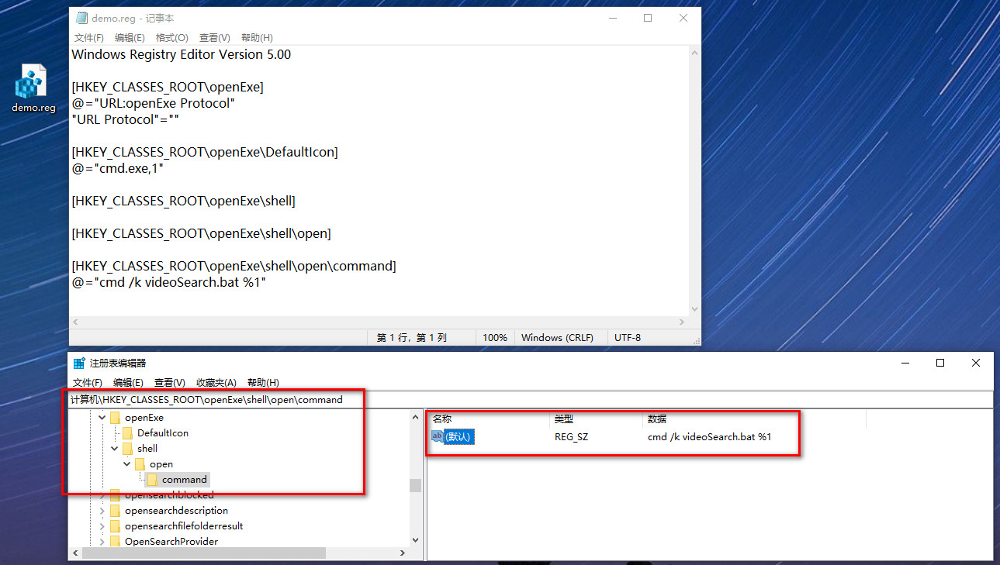
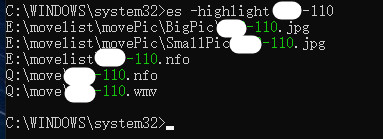

# JAV-本地视频搜索
打开JAV相关视频网站时,自动提示本地有相关的视频。

 有时候有的片子已看过，但不记得是否看过。本脚本配合Everything,搜索本地文件和显示搜索结果 


### 1.安装everything 命令行与脚本

https://www.voidtools.com/ES-1.1.0.23.zip

解压，将 `es.exe` 复制到 `C:\Windows\System32`

下载代码 `videoSearch.bat` 复制到 `C:\Windows\System32`

并运行everything.exe

### 2.添加注册表

将下面代码拷贝到桌面 demo.reg, 双击运行

```reg
Windows Registry Editor Version 5.00

[HKEY_CLASSES_ROOT\openExe]
@="URL:openExe Protocol"
"URL Protocol"=""

[HKEY_CLASSES_ROOT\openExe\DefaultIcon]
@="cmd.exe,1"

[HKEY_CLASSES_ROOT\openExe\shell]

[HKEY_CLASSES_ROOT\openExe\shell\open]

[HKEY_CLASSES_ROOT\openExe\shell\open\command]
@="cmd /k videoSearch.bat %1"
```

效果如图



### 3.添加油猴脚本

直接Greasy Fork网上安装: [JAV本地视频搜索 (greasyfork.org)](https://greasyfork.org/zh-CN/scripts/443992-jav本地视频搜索) 

手动添加网站和修改如下:

```
// ==UserScript==
// @name         test
// @namespace    http://tampermonkey.net/
// @version      0.1
// @description  try to take over the world!
// @author       You
// @match        https://javdb39.com/v/*
// @icon         data:image/gif;base64,R0lGODlhAQABAAAAACH5BAEKAAEALAAAAAABAAEAAAICTAEAOw==
// @grant        none
// ==/UserScript==

(function() {
    'use strict';
    var ps = document.getElementsByTagName('h2');
    var i=0
    for(i=0;i<ps.length;i++){
    var text = ps[i].innerHTML;
    var star = text.substring(11);
    var number = star.substring(0,star.indexOf(' '));
    console.log(number)
    }
    window.open("openExe:"+number);
    // Your code here...
})();
```

### 4.需要运行Everything, 脚本搜索和es.exe搜索才能生效。

### 5.实际效果

打开莫JAV网站的 xxx-110页面，提示如下

